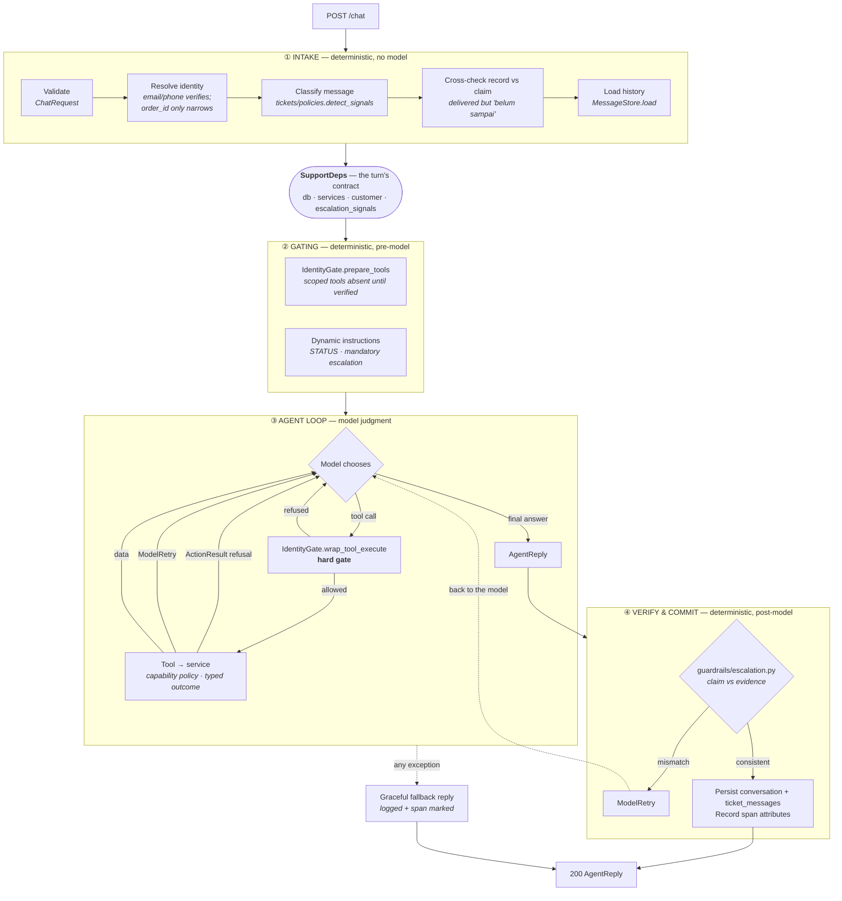

# WORKFLOW.md — the main agent's turn

One governing rule:

> **The model decides what to *say*. Code decides what is *allowed* and what is *true*.**

Everything below follows from it. The prompt (`agents/support/instructions.py`) carries only
judgment and posture — three principles, no procedure. Every rule the system actually *guarantees* is a
deterministic step outside the model, either before it runs, around each tool call, or after
it answers. Restating those rules in prose would only give them a second, drifting definition
— which is precisely how the "always call `get_customer` first" bug happened.

A turn has four phases. Three of them contain no model at all.

---

## The shape

---

## ① Intake — establish the facts before the model sees anything

Four deterministic steps produce `SupportDeps`, which is the only thing the model's world is
built from. Each is a pure function of the request, so each is unit-testable without an API key.

| Step | Where | Why it is here and not in the prompt |
|---|---|---|
| Validate | `api/app.py::ChatRequest` | Malformed input never reaches an LLM. |
| Resolve identity | `runner.resolve_customer` | Email/phone verifies; an order id is printed on the parcel, so it narrows context but never authorises. |
| Classify escalation signals | `tickets/policies.py::detect_signals` | Keyword detection over the raw message. Deterministic, testable, costs zero tokens, and biased toward false positives on purpose. |
| Cross-check record vs claim | `tickets/policies.py::claims_not_received` + order status | "Delivered" in our data against "belum sampai" from the customer is a contradiction only a human can settle. |

`SupportDeps` is the turn's contract: the database handle and the services built over it, who we
believe the caller is, and whether this turn is already obliged to escalate. Services are
constructed there rather than reached for globally, so a test can build a turn against a
throwaway database without patching anything.

## ② Gating — shape what is even possible

Two things happen before the first token, both derived from `SupportDeps`:

**The tool surface is computed, not requested.** `IdentityGate.prepare_tools` removes every
customer-scoped tool while `deps.customer is None`. The model does not decline to use them —
it never sees them. That is cheaper (no tokens spent on a refusal it must then explain) and
stronger (it cannot choose what is not on the menu).

**Per-turn facts are injected**, not baked into the static prompt: the verification STATUS
line, and — when intake found signals — a standing instruction that this turn must be handed
to a human. These are the only place turn-specific instruction text exists.

## ③ Agent loop — the only phase with judgment in it

The model picks tools and writes prose. Around every call it makes:

- **`wrap_tool_execute`** re-checks the access level and can refuse before the function body
  runs. Deliberately redundant with `prepare_tools`: that one is ergonomics, this one is the
  control, and it still holds for replayed history or a future capability re-adding a tool.
- **Each capability enforces its own policy** in its service, and the tool returns a *typed
  outcome*. A refusal is an `ActionResult(code=…, detail=…)` — a correct business answer, not an
  exception, and `success` is derived from the code rather than stored beside it. A recoverable
  mistake (stale order id) raises `ModelRetry` and goes back for one more try. An infrastructure
  failure is caught and returned as a refusal that offers escalation.

The load-bearing example: `create_return` takes **no `refund_amount` parameter**. `ReturnService`
derives the value from `order_items` and applies the ceiling to a number the model never touched.
Had the amount been an argument, the guard would be checking a figure chosen by the guarded party.

## ④ Verify and commit — trust, then verify

`AgentReply.escalated` is a *claim*. `ctx.messages` is the *evidence*. The output validator in
`guardrails/escalation.py` reconciles them in both directions:

- required escalation with no `escalate_ticket` call → `ModelRetry`;
- `escalated=True` with no `escalate_ticket` call → `ModelRetry`.

The second matters more than it looks: reporting an escalation that never happened is worse
than not escalating, because it closes the loop with a human who believes a ticket is waiting.

`ModelRetry` returns the model to phase ③ with the correction, so the usual outcome is a
compliant second attempt the customer never notices.

Then: persist the conversation through `MessageStore` — the framework's own message format, into
the `conversations` table, system prompts stripped — write the turn into `ticket_messages`, and
record `escalated`, token counts, and request count on the span.

## Failure path

Any exception escaping phase ③ — provider quota exhausted, retries spent, an unanticipated
tool error — produces the fallback `AgentReply`: an honest sentence plus the offer of a human.
A customer-facing chat endpoint must never answer with a stack trace or a bare 503. The
failure is not swallowed: it is logged with its traceback and the span is marked `failed`.

---

## Where each requirement is actually enforced

The point of the table: not one of these lives in the prompt.

| Requirement | Enforced by | Phase |
|---|---|---|
| No cross-customer data | `WHERE customer_id = ?` in every scoped query in `shared/database.py` | ③ (data layer) |
| Verify before sensitive data | `guardrails/identity_gate.py` — `prepare_tools` + `wrap_tool_execute` | ② and ③ |
| Refund > Rp 1.000.000 escalates | `ReturnService` derives the amount; `returns/policies.py::requires_escalation` | ③ |
| No address change once shipped | `orders/policies.py::can_change_address` | ③ |
| Escalate on fraud/legal/safety/human | `tickets/policies.py::detect_signals` → `guardrails/escalation.py` | ① and ④ |
| Escalate on inconsistent data | `tickets/policies.py::claims_not_received` + order status | ① |
| Never claim a false escalation | `guardrails/escalation.py` against `ctx.messages` | ④ |
| Graceful tool/DB failure | typed `ActionResult` + `runner.FALLBACK` reply | ③ and ④ |

## What the prompt is left holding

Only what code cannot express: tone, language, and three principles — answer from evidence, be
honest about limits, know when to hand off. Per-tool specifics live in the tool docstrings
(which are the descriptions the model reads); the output contract lives in the `AgentReply`
field descriptions. Each fact has exactly one home.

## What this shape buys

- **Guarantees are testable without a model.** `tests/test_guardrails.py` asserts the *rules*,
  in milliseconds, with no API key — rather than sampling an LLM and hoping.
- **The prompt can change without weakening a guarantee.** Rewriting the instructions to be
  high-level, as they now are, moved no enforcement.
- **Adding a scenario is composition.** A new tool needs one entry in its own capability's
  `ACCESS` map and, if it carries a rule, one function in that capability's `policies.py`. A new
  domain is a folder. The gate, the validator, and the fallback already cover it — and an
  unclassified tool fails closed.

## Deliberate limits

- **Identification, not authentication.** The schema has no OTP or password, so a matching
  email proves knowledge of an email. Documented in `DESIGN.md` §4 rather than dressed up.
- **Conversation history is a row per session in SQLite**, trimmed to a trailing window. It
  survives a redeploy and a second worker, which an in-process dict does not; what it does not
  do is summarise, so a very long conversation loses its oldest turns outright.
- **Grounding is enforced by construction, not verified per claim.** Tools are the only route
  to data, but nothing checks each sentence against the tool results. The natural next step is
  an offline eval suite with an LLM judge — not a second model call in the request path.
